# Advanced Lane Finding
[](http://www.udacity.com/drive)

### Summary

Steps of this project were the following:  

1. Do Camera Calibration
2. Implement Still Image Pipeline. As a result, the original image has an overlay marking 
lane boundaries, and numererical estimations of the curvature and vehicle position.
  1. Apply the distortion correction to the raw image.  
  2. Apply a perspective transform to rectify binary image ("birds-eye view"). 
  3. Use color transforms, gradients, etc., to create a thresholded binary image.
  4. Detect lane pixels and fit to find lane boundary.
  5. Determine curvature of the lane and vehicle position with respect to center.
  6. Warp the detected lane boundaries back onto the original image.
3. Implement Video Pipeline. As a result, 

## 1. Camera Calibration

**GOAL:** *Compute the camera calibration matrix and distortion coefficients
given a set of chessboard images.*

**TODO**


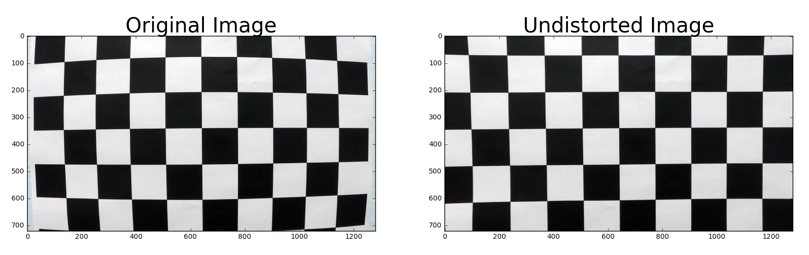

## 2. Still Image Pipeline Implementation

**GOAL:** *Output visual display of the lane boundaries and numerical estimation of lane 
curvature and vehicle position.*

**TODO**


### 2.1 Distortion Correction

**GOAL:** *Apply the distortion correction to the raw image.*

**TODO**

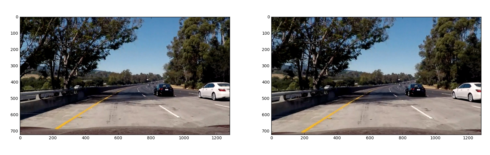

### 2.2 Perspective Transform

**GOAL:** *Apply a perspective transform to rectify the image ("birds-eye view")*

For transform from "driver view" to "birds-eye view" the given images `solidWhiteRight.jpg` and `solidYellowLeft.jpg` were used. By experimenting the following source and destination points were found and used for transformantion matrix generation. Those seemed to perform reasonably well for both 540x960 and 720x1280 images.

```
shape = img.shape
src = np.float32([
    [shape[1]*.4396, shape[0]*.6389],
    [shape[1]*.1458, shape[0]],
    [shape[1]*.875,  shape[0]],
    [shape[1]*.5625  shape[0]*.6389]
])
dst = np.float32([
    [shape[1]*.25, 0],
    [shape[1]*.25, shape[0]],
    [shape[1]*.75, shape[0]],
    [shape[1]*.75, 0]
])
    
```

Transformation was visually validated using images of different resolution (see below).
Also, an assumption was made, that "driver view" is exactly the same for test images, and videos for 
the rest of the project.

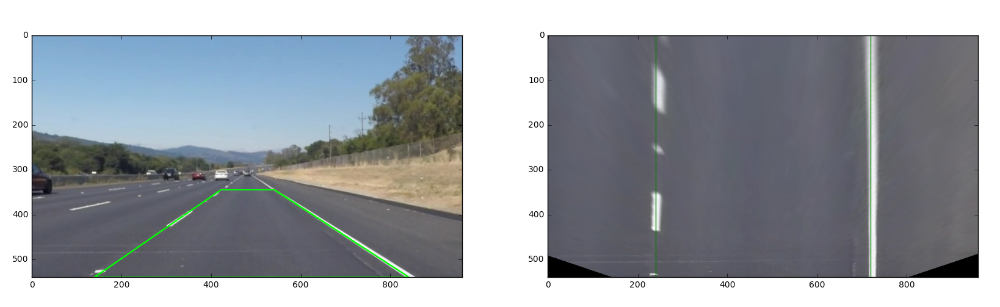
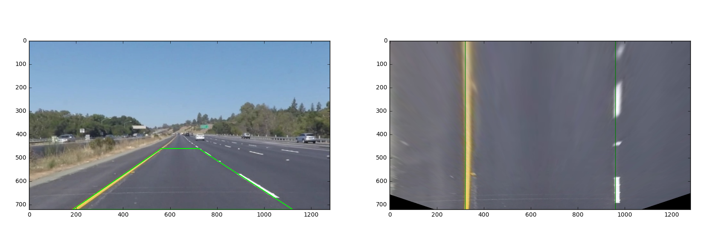


### 2.3 Lane Line Masking

**GOAL:** *Use color transforms, gradients, etc., to create a thresholded binary image.*

**TODO**

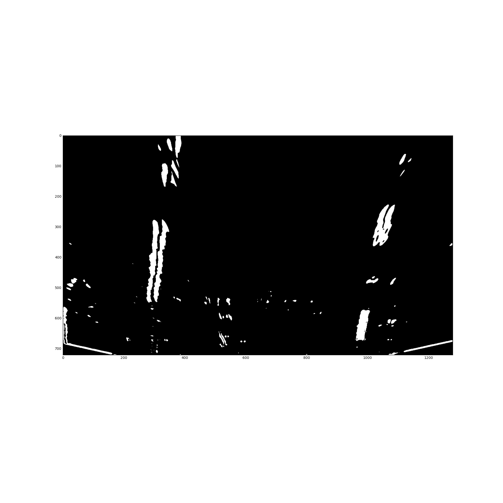

### 2.4 Lane Line Finding

**GOAL:** *Detect lane pixels and fit to find lane boundary.*

First, from the binary mask, we calculate column-wise sum of the bottom half. This gives approximate location of the lines. Because of the perspective transform, lines are better observable on the bottom half of the image, and thus more probably present in the bottom half of the mask too. 

This is illustrated in the histogram below. We make a strong assumption here that the highest peak on the left side represents left lane line, and the highest peak on the right side represent the right lane line. The position and width of the peaks gives an approximation of where the lines are in the mask. 

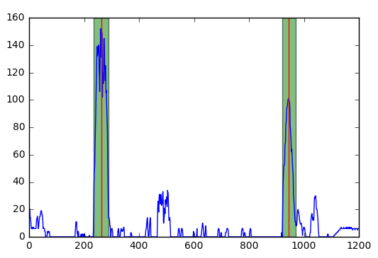

Next we will divide the mask to eight slice and for each slice we try to locate a peak close to the area where the previous peak was. Initial starting points are the left and right window from the half-mask histogram. For each slice, first the left and right window are adjusted based on the window size on previous slice and the max peak within the window. Window borders are shifted left or right until border value is larger than 1/8 of the local maximum. Center of mass (red lines in the image below) of each window is recorded for the polynomial fitting phase.

On next slice, the previous windows are expanded 25 pixels both sides, in order to catch bending lines. If the mask is empty within the window, the point is marked for future correction (for example, sixth slice left window on the image below).

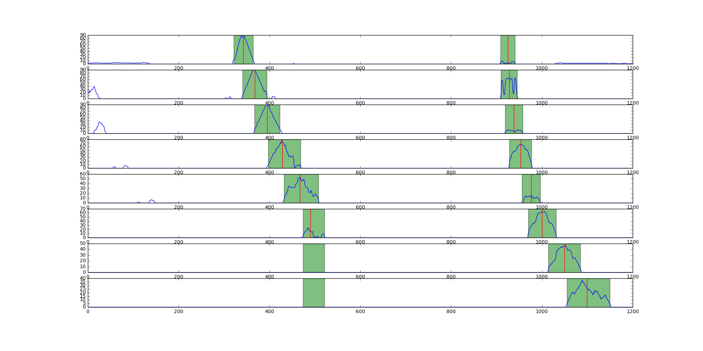

After slicing, we have two (x,y) arrays, one for left line and other for right line, that can be used for fitting a second order polynomial. For x-coordinates we use center of masses for windows, and for y-coordinates centers of slices. We have maximum of 8 points each side for polynomial fitting. Some points may be missing but it should not have too big effect on the final polynomial.

Now, points in the arrays are fitted to second order polynomial in order to create a curves that represents the lane lines. After fitting, new points of the polynomial are calculated so that the points span from the top of the image to the bottom. We originally had y-coordinates from the center points of each slice, for example (720x1280 case) `[675, 585, 495, 405, 315, 225, 135, 45]`. The final points will be from bottom to top, for example `[720, 630, 540, 450, 360, 270, 180, 90, 0]` (see the plot below).

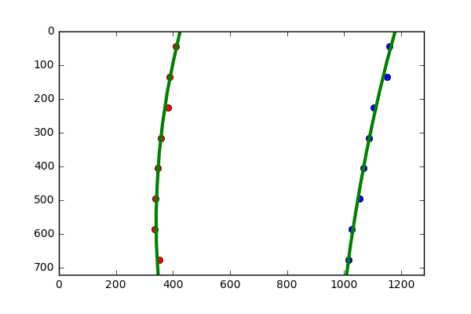


### 2.5 Lane Curvature and Car Position Calculation

**GOAL:** *Determine curvature of the lane and vehicle position with respect to center.*

**TODO**

### 2.6 Lane Overlay Generation
 
**GOAL:** *Output visual display of the lane boundaries*

**TODO**

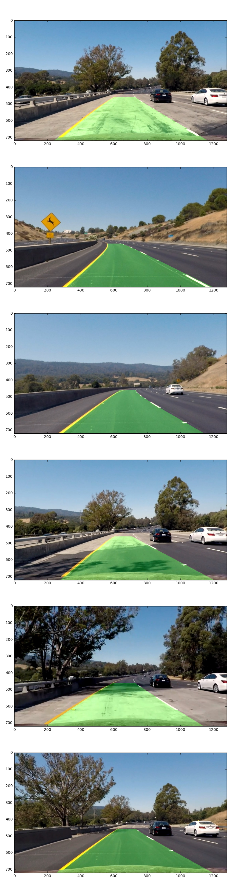

## 3. Video Pipeline Implementation

**TODO**

## 4. Discussion

### 4.1

Assumptions: vehicle is close to the center, left line on left half and right line on right half. Prone to errors, maybe should discard peaks not high enough? Confidence level for detection (not enough points for polynomial fitting)?

### 4.2 Possible Improvements


**Multilane tracking:** It would be possible to detect and track multiple lanes if we used different perspective transform.  In real life situation it would be feasible and useful to track not only the lane the car is driving, but also both lane on the side. The image below illustrates this kind of transform:
 
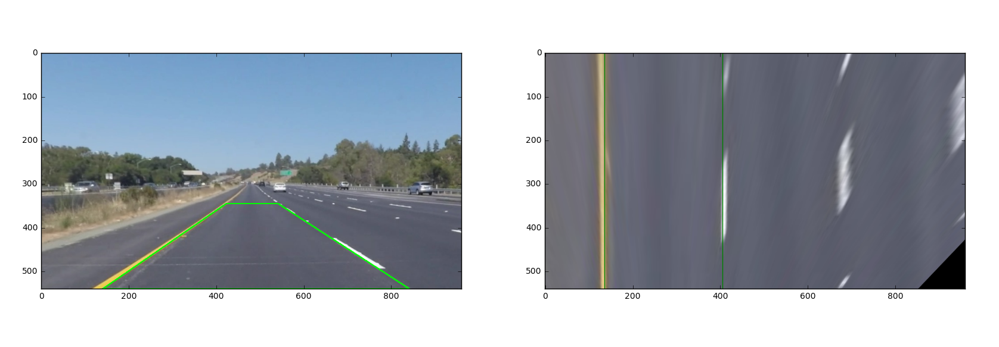

**Adaptive thresholding:** In some situations, for example when the road surface is dark, color thresholding works extraordinarily well for line finding. However, on bright conditions it can fail badly. The two images below illustrate this situation. Thresholding is based only on luminance and light colors. The first image has dark road surface, and the second one light surface with sunlight. 

In real life, thresholding might be able to (or even should) adapt the light conditions on the area of interest (brightness, contrast etc.), and use the best method for the conditions.  

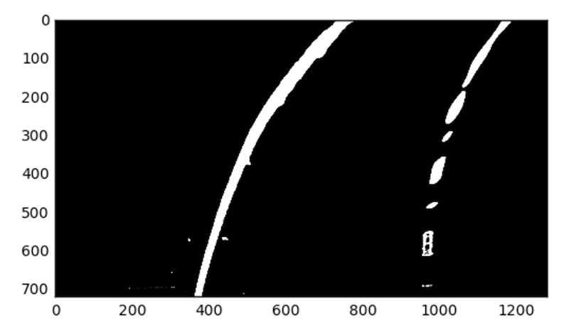
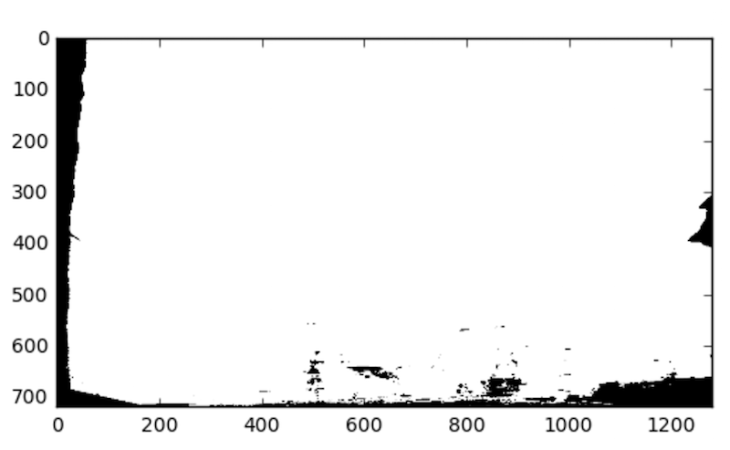

