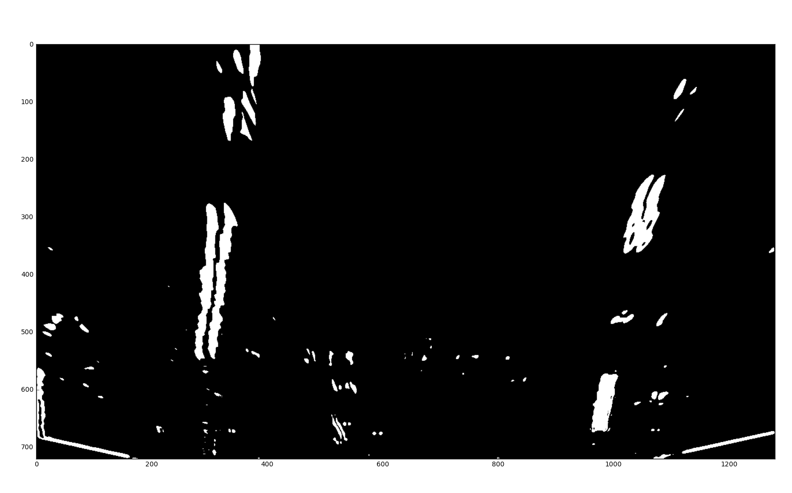
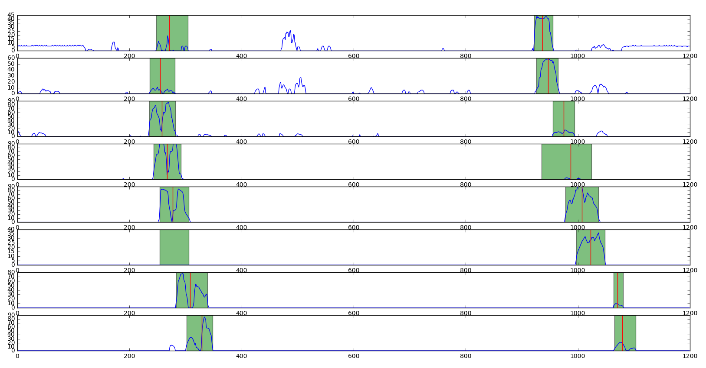

# Advanced Lane Finding
[](http://www.udacity.com/drive)

### Summary

Steps of this project were the following:  

1. Do Camera Calibration
2. Implement Still Image Pipeline. As a result, the original image has an overlay marking 
lane boundaries, and numerical estimations of the curvature and vehicle position.
  1. Apply the distortion correction to the raw image.  
  2. Apply a perspective transform to rectify binary image ("birds-eye view"). 
  3. Use colour transforms, gradients, etc., to create a thresholded binary image.
  4. Detect lane pixels and fit to find lane boundary.
  5. Determine curvature of the lane and vehicle position with respect to center.
  6. Warp the detected lane boundaries back onto the original image.
3. Implement Video Pipeline. The output of the pipeline is modified video which has 
lane area marked.
4. Discussion of results and possible improvements

All code written for this project is in Jupyter notebook advanced-lane-lines.ipynb
This document tries to follow the code order in the notebook

## 1. Camera Calibration

**GOAL:** *Compute the camera calibration matrix and distortion coefficients
given a set of chessboard images.*

Camera calibration is based on 20 chessboard images that are provided in `camera_cal` directory.
Images are taken from different angles and distances. Calibration is based on the know fact that the 
chessboard is a rectangle in real life. By selecting a number of points (chessboard corners) we are able
to calculate a transformation matrix (using `cv2.calibrateCamera()`) which can in turn be used to correct inherit 
distortion of camera images. This is important to get calculations based on image pixels right.


Code for the calibration is in the beginning of the notebook, and test code in the “Playground area”. Undistorted 
chessboard image looks like this:


## 2. Still Image Pipeline Implementation

**GOAL:** *Output visual display of the lane boundaries and numerical estimation of lane 
curvature and vehicle position.*

The notebook has first utility functions for different pipeline steps. Functions are grouped by area. The last code block
in this section collects all utility function to single pipeline. 


### 2.1 Distortion Correction

**GOAL:** *Apply the distortion correction to the raw image.*

First step in the pipeline is to correct the distortion. This is done using camera matrix `mtx` and distortion coefficients `dist` from 
camera calibration 

```
cv2.undistort(img, mtx, dist, None, mtx)
```

Below are ‘raw’ and corrected images. The original camera image is not very much distorted. One can notice the correction from different shape of 
the trees. 


### 2.2 Perspective Transform

**GOAL:** *Apply a perspective transform to rectify the image ("birds-eye view")*

For transform from "driver view" to "birds-eye view" the given images `solidWhiteRight.jpg` and `solidYellowLeft.jpg` were used. After a lot of experimenting, the following source and destination points were found. Thoe are used in transformation matrix generation. Those seemed to perform reasonably well for both 540x960 and 720x1280 images.

```
shape = img.shape

src = np.float32([
    [shape[1]*.4396, shape[0]*.6389],
    [shape[1]*.1458, shape[0]],
    [shape[1]*.875,  shape[0]],
    [shape[1]*.5625  shape[0]*.6389]
])

dst = np.float32([
    [shape[1]*.25, 0],
    [shape[1]*.25, shape[0]],
    [shape[1]*.75, shape[0]],
    [shape[1]*.75, 0]
])
    
```

The rest is easy. Using OpenCV the perspective transform, warping, goes like this: 

```
M = cv2.getPerspectiveTransform(src, dst)
warped = cv2.warpPerspective(img, M, (shape[1],shape[0]), flags=cv2.INTER_LINEAR)
```

There is a function `perspective_transform(img, src, dst)` which does the job. Transformation was visually validated using images of different resolution (see below).
Also, for the rest of the project, there has to be an assumption, that the ”driver view" is exactly the same for all test images, and videos (camera is in the same position).


### 2.3 Lane Line Masking

**GOAL:** *Use colour transforms, gradients, etc., to create a thresholded binary image.*

The purpose of masking is to ‘extract’ lane line, and preferably only those, from the warped image. For this two different approaches were used.
First, sobel operator based edge detection. Especially x-orientation was used, because this should be more effective to vertical lines that y-orientation. The other approach was colour space and plane base thresholding. 

The code for gradient based edge detection in the notebook is mostly derived from the lecture material For colour space handling, I implemented 
a function which can handle different colour spaces and planes:

```
def color_threshold(img, channel='R', thresh=(0,255))
```

The mask combination was searched by experimenting  (see the end of Notebook, and blocks ’threshold experimenting’ and ‘colorspace exploring’. First version used looked like this:

```
rgb =       color_threshold(warped, 'R', (190,255))
rgb = rgb & color_threshold(warped, 'G', (190,255)) 
rgb = rgb & color_threshold(warped, 'B', (0,155))
sobel = abs_sobel_threshold(warped, 'x', 17, (40,180))
luminance = color_threshold(warped, 'L', (200,245))
mask = np.zeros_like(sobel)
mask[(sobel==1) | (luminance==1) | (rgb==1)] = 1
```

There is RGB filtering for detecting light colors, sobel operator for edge detection and luminance channel masking. This turned out not to be viable solution, when I started working with video. 

Next approach was to use only Blue-channel for detecting white, and brightness channel in HSL space for yellow detection. We kept sobel operator for situation where colour detection is not working. This turned out to be good combination also for the project video.

```
rgb = color_threshold(img, 'B', (200,255))
sat = color_threshold(img, 'S', (160,255))
sobel = abs_sobel_threshold(img, 'x', 17, (40,180))
mask[(sat==1) | (rgb==1) | (sobel==1)] = 1
```
A sample mask:



### 2.4 Lane Line Finding

**GOAL:** *Detect lane pixels and fit to find lane boundary.*

***Half-frame histogram detections***

First, from the binary mask produced in the previous phase, we calculate a column-wise sum of the bottom half. This gives approximate location of the lines. Because of the perspective transform, lines are better observable on the bottom half of the image, and thus more probably present in the bottom half of the mask. 

This is illustrated in the histogram below. We make a strong assumption here that the highest peak on the left side represents left lane line, and the highest peak on the right side represent the right lane line. The position and width of the peaks gives an approximation of where the lines are in the mask. 


***Slicing***

Next we will divide the mask to eight slice and for each slice we try to locate a peak close to the area where the previous peak was. Initial starting points are the left and right window from the half-mask histogram. For each slice, first the left and right window are adjusted based on the window size on previous slice and the max peak within the window. Window borders are shifted left or right until border value is larger than 1/8 of the local maximum. Center of mass (red lines in the image below) of each window is recorded for the polynomial fitting phase.

On next slice, the previous windows are expanded 25 pixels both sides, in order to catch bending lines. If the mask is empty within the window, the point is marked for future correction (for example, sixth slice left window on the image below).



***Fitting second order polynomial***

After slicing, we have two (x,y) arrays, one for left line and other for right line, that can be used for fitting to a second order polynomial. For x-coordinates we use center of masses for windows, and for y-coordinates middle of the corresponding slice. We have maximum of 8 points each side for polynomial fitting. Some points may be missing but it should not have too big effect on the final polynomial.

Now, points in the arrays are fitted to second order polynomial in order to create a curves that represents the lane lines. After fitting, new points of the polynomial are calculated so that the points span from the top of the image to the bottom. We originally had y-coordinates from the center points of each slice, for example (720x1280 case) `[675, 585, 495, 405, 315, 225, 135, 45]`. The final points will be from bottom to top, for example `[720, 630, 540, 450, 360, 270, 180, 90, 0]` (see the plot below).


### 2.5 Lane Curvature and Car Position Calculation

**GOAL:** *Determine curvature of the lane and vehicle position with respect to center.*

**NOTE!** These calculations were not implemented in still image pipeline, but only in video pipeline (see chapter 3.)

For lane curvature calculation we have used the numbers give in the lecture material. Lane width is 3.7m and the area of inters expands to 30 meters. We calculate the curvature of the center of the lane. This we get by calculating average of the left and right line points, and fitting those to polynomial. Pixel-points has to be converted to real world meter-points first. Curvature calculation is implemented in function `radius()`, and it returns the radius of the lane curvature in meters. If the lane is curving towards left (the coefficient of the highest order is negative), then the radius is always negative.

Function `vehicle_offset()` returns vehicle’s offset to the center of the lane. For this we assume that the camera is mounted to the center axis of the vehicle, so that vehicle’s center line is aligned to image’s vertical center line. We use again assumption that the lane width is 3.7m and we have precisely detected both left and right lanes. Offset is negative if vehicle is on the left from the center line, and positive in the opposite case.

### 2.6 Lane Overlay Generation
 
**GOAL:** *Output visual display of the lane boundaries*

The last phase in the image pipeline is the fill the lane are with solid color, and warp it back to the original perspective. For this we use the method given in lecture material (see function `make_lane_overlay()`). Basically we just create a color image, with the same shape as the bitmask used, use `cv2.fillPoly()` to fill the area limited by left and right line polynomials, and then use revers transformation (swap source and destination points in transform matrix formation).  


## 3. Video Pipeline Implementation

### 3.1 Video Processing

We use `moviepy.editor` module for video processing. A `VideoFileClip` instance is created from the video file, and each frame is processed in `do_frame()` function, which returns an image with lane overlay and other information. `do_image()` is called from `VideoFileClip.fl_image()` which effectively replaces the original clip frame by frame by the outputs from `do_frame()`. 

Because video is a series of successive frames, we can make use of the state data from previous frames when detecting new lane lines. There are separate `Line`-objects for left- and right lane lines for storing the state information. Once the line has be reliably detected by the half-frame histogram method (see 2.4. above), an approximate region of the line is stored in the `Line`-object. On next frame, we use this information, instead of taking a histogram. We also maintain an array of lane line points in form of  moving average of 10 last reliable occurrences. Line detection is considered reliable, if 5 (or 4, see below) out of 8 possible points are detected. 
 
Line state processing and book-keeping is done in `Line.new_frame()` method, which is called separately for left and right lines, and for each frame.


### 3.2 Frame Processing

Single frame image processing pipeline is very much similar than described in chapter 2, with two exceptions. The first one, using data from previous frames, was described above. The second is, that there is additional information rendered on each output frame:

* **Radius** of the curve in meters. The arrow on the right side of the quantity indicates steering direction. If calculated radius is greater than 5000m it is not shown, because calculation tends to be noisier, when the lane get straighter.
* **Offset** to the center of the lane in meters. The arrow on the right side of the quantity indicates steering direction towards the center of the lane.
* **Vehicle center indicator**. A short red line segment in the center of the bottom edge of the image.
* **Line detection indicators**: These are red or green circles in the bottom corners of the image. Green circle tells that the corresponding lane line was reliably detected. Red circle tells that detection was not good enough.
 
Curvature and car position are calculated as described in *2.5*. The quantities are run thru first order filter before displaying, in order to smooth down the information. Smoothing factor is 0.1. 

Sample video frame is shown below:


### 3.3 Sample videos

Below is a link to the processed project video:

<a href="http://www.youtube.com/watch?feature=player_embedded&v=KV3OqI1hoK8
" target="_blank"></a>

The project video uses basically the same thresholding parameters as the still images above (chapter 2.6). There is a small anomaly at 40s. Possibly detection of the lines at the far end of the lane are fails, and polynomial fitting skips the bending of lines. Algorithm recovers from the situation in couple of seconds. 

The next one is the processed challenge video:

<a href="http://www.youtube.com/watch?feature=player_embedded&v=x2OZ2JIeh6c
" target="_blank"></a>


For the challenge video I had to use another kind of thresholding strategy, because of the brightness changes in the frames, shadows and black lines on the road surface. Especially the black lines ruled out edge detection, because it produced very strong false positives. Now, I try to detect white lines using RGB channels, and yellow line from value (brightness) channel in the HSV space. V-channel is used adaptively so that the masking range is limited radically, if V-channel masking gives a big number of ones. Also, in this video, especially in the beginning, the far end of lane area is badly detected, giving a bit funny looking overlay to the lane. I guess this wouldn't be a safety hazard, because closer to the vehicle curvature is detected correctly. But of course, this is one item to the improvement list.

In addition, this new thresholding strategy required other parameter adjusting. Number of matching slice for reliable detection was dropped to 4 and on the other hand threshold for accepting a slice was raised to 15 (15% of max) (see function `next_window_position(line, lane, mask)`).
  

Adaptive thresholding used in challenge video (still very naive, see discussion):
```
rgb = color_threshold(img, 'R', (200,255))
rgb = rgb & color_threshold(img, 'G', (200,255)) 
rgb = rgb & color_threshold(img, 'B', (200,255))
bri = color_threshold(img, 'V', (168,255))
if np.sum(bri)> 100000:
     bri = color_threshold(img, 'V', (200,255))
 mask[(bri==1) | (rgb==1)] = 1
```

## 4. Discussion

This was an interesting deep dive to traditional computer vision after deep learning project. All the time during the journey I have been thinking, how this could be done using deep learning tools, [like in this article](http://www.cv-foundation.org/openaccess/content_cvpr_2016_workshops/w3/papers/Gurghian_DeepLanes_End-To-End_Lane_CVPR_2016_paper.pdf). Maybe some day.

The algorithm implemented in the project uses still quite many assumptions:  vehicle is close to the center, left line on left half and right line on right half of the image etc. In real world situation one should cope with these.

I implemented the sliding window a bit differently than guidelines in the lecture material were. I get at maximum 8 points for polynomial fitting. This kind of leaves more space to errors in the fitting phase, because one point too far may give funny polynomials (see below). And especially, if we have too few points. Also, I’m not quite confident, that variable window size is a good idea. On the other hand, fitting with less points is faster.


### 4.1 Possible Improvements
**Image size:** Program expects 1280x720 frame size. It is quite straightforward to change the code to use variable sized images.

**Locked state:** There is ‘locking’ feature which means that line has been correctly detected. However, no ‘unlocking’ is implemented. Now, if we have a long sequence of bad frames, line parameters are preserved over the sequence. It would be better to ‘unlock’ the line and start over from histogram detection.

**Multilane tracking:** It would be possible to detect and track multiple lanes if we used different perspective transform.  In real life situation it would be feasible and useful to track not only the lane the car is driving, but also both lane on the side. The image below illustrates this kind of transform:
 


**Adaptive thresholding:** Much of the success with line finding boils down to the thresholding strategy. In some situations, for example when the road surface is dark, colour thresholding works extraordinarily well for line finding. However, on bright conditions it can fail badly. The two images below illustrate this situation. Thresholding is based only on luminance and light colors. The first image has dark road surface, and the second one light surface with sunlight. 

In real life, thresholding might be able to (or even should) adapt the light conditions on the area of interest (brightness, contrast etc.), and use the best method for the conditions. This was used with challenge video already, but I’m sure there would be a lot of room for experimenting. 


**Better algorithm for mask validation:** This could be part of adaptive threasholding, If the mask, or slice of mask is totally contaminated with ‘ones’, we should either discard the slice, or try to regenerate the mask with new thresholding parameters.   

**Sensor data:** Would need speed information for video pipe, for estimating how long a distance there is between two frames. That would improve detection accuracy.

